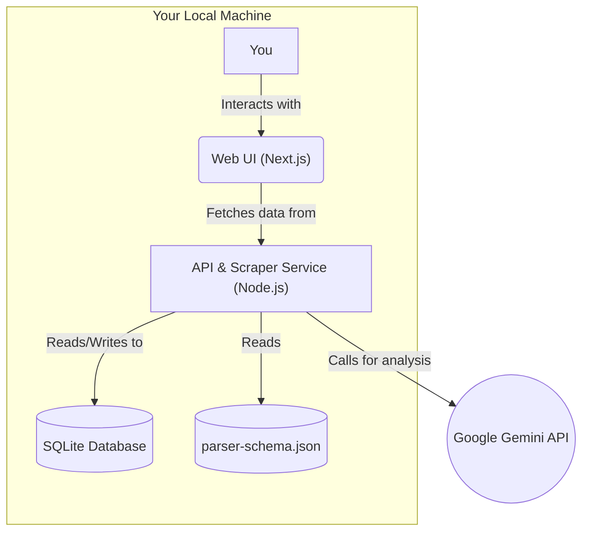

# Car Finder AI Fullstack Architecture Document

### High Level Architecture

#### Technical Summary
This project will be a full-stack application operating under a local-first execution model. The system consists of two primary components within a monorepo: a backend service built with Node.js responsible for scraping and AI analysis, and a frontend web application built with Next.js for the user interface. Key architectural patterns include a schema-driven parser for resilience, an AI abstraction layer for future flexibility, and a repository pattern for clean data access. This design directly supports the MVP goal of creating a fast, zero-cost, and powerful personal analysis tool.

#### Platform and Infrastructure Choice
* **Platform:** Local-First Execution Model. The entire application is designed to run on your local desktop/laptop machine.
* **Key Services:**
    * **Local:** Node.js Runtime, SQLite Database Engine, Local File System.
    * **External:** Google Gemini API.
* **Deployment Host and Regions:** N/A - Local execution.

#### Repository Structure
* **Structure:** Monorepo
* **Monorepo Tool:** Turborepo
* **Package Organization:** The monorepo will contain `apps` (for the `web` UI and `api` backend) and `packages` (for shared code like `types` and `db` access).

#### High Level Architecture Diagram


#### Architectural Patterns

  * **Local-First Architecture:** All core components run locally. *Rationale:* This provides the fastest development path and achieves the zero-cost requirement for the MVP.
  * **Monorepo:** A single repository for all code. *Rationale:* Simplifies sharing types and logic between the frontend and backend.
  * **Schema-Driven Parser:** The scraper's parsing logic is externalized to a JSON file. *Rationale:* This makes the scraper resilient to website changes.
  * **AI Provider Abstraction Layer:** AI calls are routed through an internal service. *Rationale:* Decouples the application from a specific AI provider, making it easy to add others in the future.
  * **Repository Pattern:** Database interactions will be handled by a dedicated "repository" layer. *Rationale:* This abstracts the data logic, making the application easier to test.
  * **Service Contract Architecture:** Cross-package service dependencies use interface contracts and dependency injection. *Rationale:* Enables proper testing with mocks and maintains clean architectural boundaries.
  * **Integration Testing Infrastructure:** Comprehensive testing framework with service abstractions and mock implementations. *Rationale:* Ensures reliable cross-package integration testing in the monorepo environment.

### Tech Stack

| Category | Technology | Version | Purpose | Rationale |
| :--- | :--- | :--- | :--- | :--- |
| **Monorepo** | Turborepo | `~2.0.0` | Manages the monorepo workspace | Lightweight and fast. |
| **Language** | TypeScript | `~5.5.0` | Primary language for all code | Type safety improves code quality. |
| **FE Framework** | Next.js | `~14.2.0` | Frontend application and simple API | Robust React framework for UI and simple API routes. |
| **Styling** | Tailwind CSS | `~3.4.0` | Utility-first CSS framework | Allows for rapid UI development. |
| **UI Components**| Shadcn UI | `CLI` | Component library primitives | Accessible and unstyled components for easy customization. |
| **State Mgmt** | React Context/Hooks| `N/A` | Manages global UI state | Built-in to React, avoiding extra dependencies. |
| **BE Runtime** | Node.js | `~20.11.0` | Executes backend scripts/API | Current Long-Term Support (LTS) version. |
| **Web Scraping**| Puppeteer | `~22.0.0` | Headless browser for scraping | Robust control over a headless Chrome instance. |
| **Database** | SQLite | `~5.1.0` | Local database storage | Simple, file-based SQL database for a zero-cost app. |
| **AI SDK** | `@google/generative-ai` | `~0.11.0` | Gemini API client library | The official Google SDK. |
| **Testing** | Jest & RTL | `~29.7.0` | Unit and integration testing | The standard testing suite for Next.js/React. |

### Data Models

#### Vehicle

**Purpose:** To represent a single vehicle listing, combining the rich data scraped from the source with our own generated analysis and user-workflow data. This will be our primary data entity.

**TypeScript Interface:**
This interface will be placed in the shared `packages/types` directory within our monorepo, ensuring both the frontend and backend use the exact same data structure.

```typescript
export type VehicleSource = 'otomoto' | 'olx';
export type VehicleStatus = 'new' | 'to_contact' | 'contacted' | 'to_visit' | 'visited' | 'deleted';
export type SellerType = 'private' | 'company' | null;

export interface SellerInfo {
  name: string | null;
  id: string | null;
  type: SellerType;
  location: string | null;
  memberSince: string | null;
}

export interface Vehicle {
  id: string; // Our internal unique identifier
  source: VehicleSource;
  sourceId: string; // The ID from the source site (e.g., Otomoto's ID)
  sourceUrl: string;
  sourceCreatedAt: Date; // When the ad was published on Otomoto/OLX

  // Raw Scraped Data
  sourceTitle: string;
  sourceDescriptionHtml: string;
  sourceParameters: Record<string, string>;
  sourceEquipment: Record<string, string[]>;
  sourcePhotos: string[];
  
  // Our Processed & Normalised Data
  title: string; // Cleaned title
  description: string; // Translated, plain-text description
  features: string[]; // Normalised, e.g., ["comfort_air_conditioning"]
  pricePln: number;
  priceEur: number;
  year: number; 
  mileage: number;
  sellerInfo: SellerInfo;
  photos: string[]; // Cleaned photo URLs

  // AI Generated Data
  personalFitScore: number | null;
  marketValueScore: string | null; // e.g., "-5%" or "+10%"
  aiPriorityRating: number | null;
  aiPrioritySummary: string | null;
  aiMechanicReport: string | null;
  aiDataSanityCheck: string | null;

  // User Workflow Data
  status: VehicleStatus;
  personalNotes: string | null;

  // Our Timestamps
  scrapedAt: Date;
  createdAt: Date; 
  updatedAt: Date;
}
```
**Relationships:**
For the scope of the MVP, the Vehicle model is a self-contained entity. It has no direct relationships with other data models.

### API Specification

This API provides the necessary endpoints for the web UI to fetch vehicle data and interact with the AI services. It is designed around a primary conversational endpoint for all AI interactions.

```yaml
openapi: 3.0.0
info:
  title: "Car Finder AI API"
  version: "1.0.0"
  description: "API for the personal Car Finder application."
servers:
  - url: "http://localhost:3000"
    description: "Local development server"

paths:
  /api/vehicles:
    get:
      summary: "Get all vehicles"
      description: "Retrieves a list of all vehicles from the database, including all processed and AI-generated data."
      responses:
        '200':
          description: "A list of all vehicle objects."
          content:
            application/json:
              schema:
                type: array
                items:
                  $ref: "#/components/schemas/Vehicle"

  /api/vehicles/{id}:
    get:
      summary: "Get a single vehicle by ID"
      description: "Retrieves all details for a single vehicle by its unique internal ID."
      parameters:
        - name: "id"
          in: "path"
          required: true
          schema:
            type: "string"
            description: "The internal CUID or UUID of the vehicle."
      responses:
        '200':
          description: "A single vehicle object."
          content:
            application/json:
              schema:
                $ref: "#/components/schemas/Vehicle"
        '404':
          description: "Vehicle not found."
    patch:
      summary: "Update a vehicle's status or notes"
      description: "Updates the user-managed workflow fields for a single vehicle."
      parameters:
        - name: "id"
          in: "path"
          required: true
          schema:
            type: "string"
      requestBody:
        required: true
        content:
          application/json:
            schema:
              $ref: "#/components/schemas/UpdateVehiclePayload"
      responses:
        '200':
          description: "The updated vehicle object."
          content:
            application/json:
              schema:
                $ref: "#/components/schemas/Vehicle"
        '404':
          description: "Vehicle not found."

  /api/ai/chat:
    post:
      summary: "Have a contextual conversation with the AI assistant"
      description: "Handles all conversational AI tasks, from analysis to message generation and translation. It requires the context of the UI and the conversation history."
      requestBody:
        required: true
        content:
          application/json:
            schema:
              $ref: "#/components/schemas/ChatRequest"
      responses:
        '200':
          description: "The AI assistant's response."
          content:
            application/json:
              schema:
                $ref: "#/components/schemas/ChatResponse"

components:
  schemas:
    Vehicle:
      type: "object"
      description: "Represents a single vehicle listing with all processed and generated data."
      properties:
        id:
          type: "string"
        source:
          type: "string"
          enum: ["otomoto", "olx"]
        sourceUrl:
          type: "string"
          format: "uri"
        title:
          type: "string"
        description:
          type: "string"
        features:
          type: "array"
          items:
            type: "string"
        pricePln:
          type: "number"
        priceEur:
          type: "number"
        year:
          type: "integer"
        mileage:
          type: "integer"
        photos:
          type: "array"
          items:
            type: "string"
            format: "uri"
        personalFitScore:
          type: "number"
          nullable: true
        marketValueScore:
          type: "string"
          nullable: true
        aiPriorityRating:
          type: "number"
          nullable: true
        aiPrioritySummary:
          type: "string"
          nullable: true
        aiMechanicReport:
          type: "string"
          nullable: true
        status:
          type: "string"
          enum: ["new", "to_contact", "contacted", "to_visit", "visited", "deleted"]
        personalNotes:
          type: "string"
          nullable: true
        createdAt:
          type: "string"
          format: "date-time"
        updatedAt:
          type: "string"
          format: "date-time"
        # Note: Raw source fields are omitted here for API response clarity
        # but are present in the database model.

    UpdateVehiclePayload:
      type: "object"
      description: "Payload for updating a vehicle's workflow status."
      properties:
        status:
          type: "string"
          enum: ["new", "to_contact", "contacted", "to_visit", "visited", "deleted"]
        personalNotes:
          type: "string"

    ChatMessage:
      type: "object"
      properties:
        role:
          type: "string"
          enum: ["user", "model"]
        content:
          type: "string"

    ChatRequest:
      type: "object"
      properties:
        context:
          type: "object"
          description: "The UI context, e.g., which vehicle is being viewed."
          properties:
            view: 
              type: "string"
              enum: ["dashboard", "detail"]
            vehicleId:
              type: "string"
        conversationHistory:
          type: "array"
          items:
            $ref: "#/components/schemas/ChatMessage"
        userMessage:
          type: "string"

    ChatResponse:
      type: "object"
      properties:
        aiResponse:
          type: "string"
          description: "The AI's response, formatted in Markdown."
```

### Components

The system is broken down into Backend (Orchestration Scripts, Scraper, Parser, DB Service, AI Service, API Handler) and Frontend (API Client, Global State, Dashboard, Cards, Detail Page, Chat Panel) components, with a Service Abstraction Layer (Service Interfaces, Adapters, Mocks, Registry) providing clean integration testing capabilities.

### Core Workflows

Workflows are defined for **Data Ingestion**, **Data Analysis**, and **AI Chat Interaction** using sequence diagrams to show component interactions.

### Database Schema

A `vehicles` table will be created in SQLite using SQL DDL, with indexes for performance and a trigger to auto-update timestamps.

### Frontend Architecture

The architecture is based on Next.js App Router, with a clear folder structure for components, context, hooks, and libraries. It uses React Context for state and a dedicated API client for data fetching.

### Backend Architecture

The backend is a script-based model using `ingest.ts` and `analyze.ts` for background processing, and Next.js API routes for serving data to the UI.

### Unified Project Structure

A Turborepo monorepo will be used with `apps/web`, `apps/api`, and `packages/db`, `packages/scripts`, `packages/types`, `packages/services`, `packages/ai`.

### Development Workflow

Development is managed via `pnpm` scripts: `pnpm dev` (starts the UI), `pnpm ingest` (runs the scraper), and `pnpm analyze` (runs AI processing).

### Key Developer Standards

  * Use shared types from `packages/types`.
  * All DB access through the `packages/db` repository.
  * All frontend API calls through `lib/api.ts`.
  * API keys must be loaded from a `.env` file.
  * Cross-package service dependencies must use `packages/services` interface contracts.
  * All integration tests must use service mocks and abstractions from `packages/services`.
  * AI operations must use the provider abstraction layer from `packages/ai`.

### Checklist Results Report

**Final Decision:** **READY FOR DEVELOPMENT**
