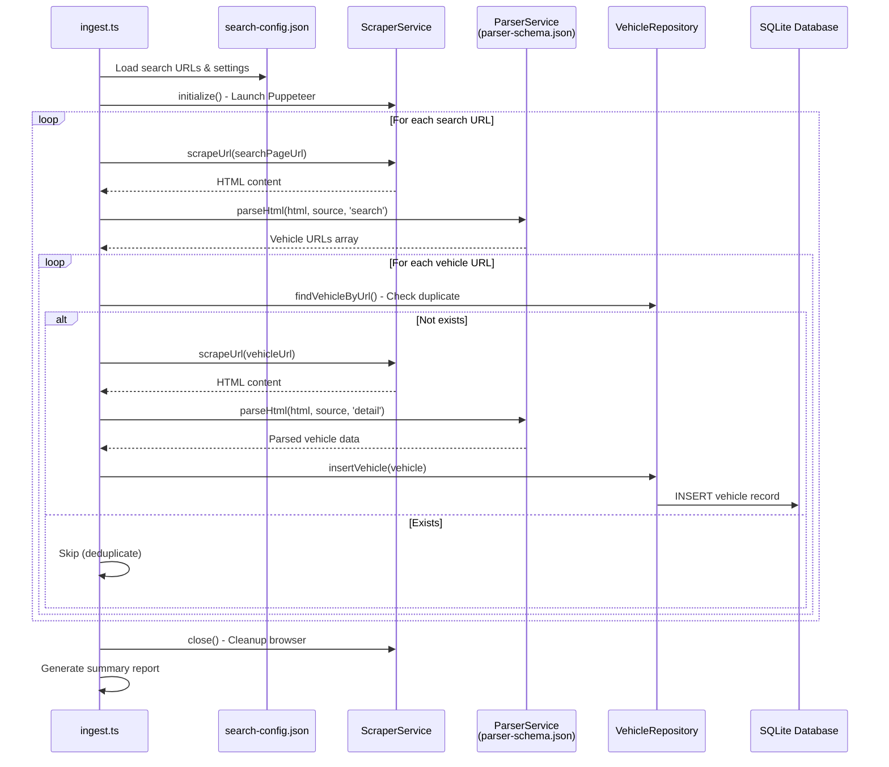
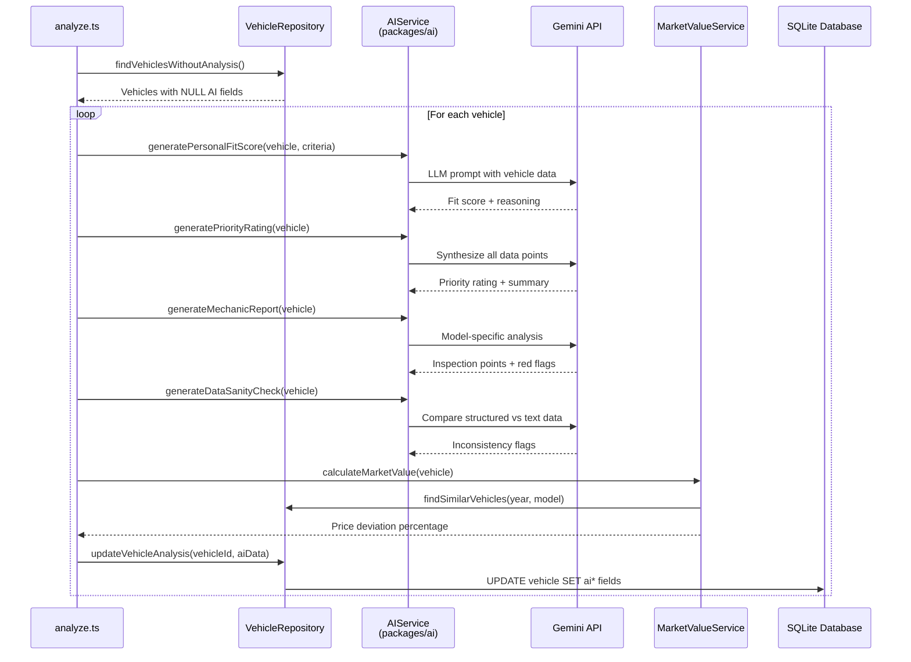
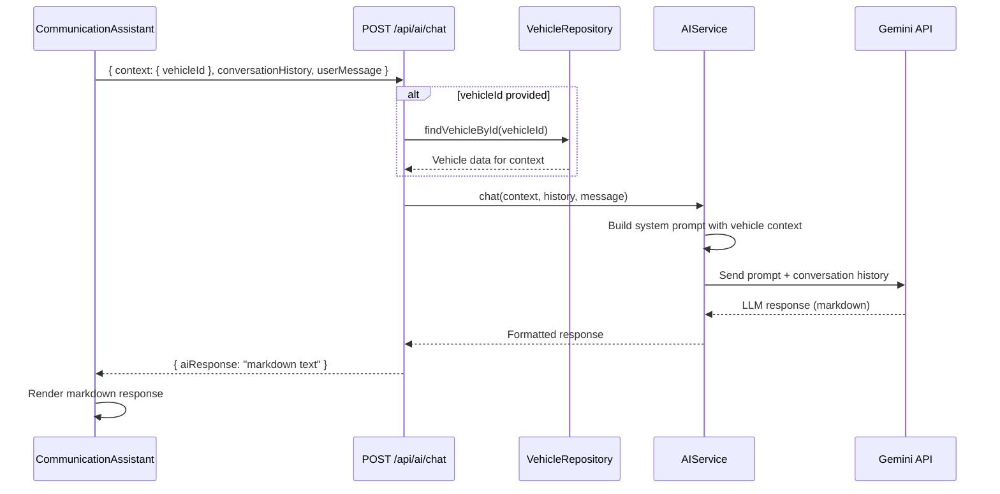

# Core Workflows

## 1. Data Ingestion Workflow

The ingestion pipeline scrapes vehicle listings from configured search URLs, parses structured data, and stores deduplicated records in the database.

**Key Points:**
- OLX uses search-only extraction (full data from search pages)
- Otomoto requires detail page visits for complete data
- Deduplication via `sourceUrl` uniqueness check
- Respectful delays between requests (configurable in search-config.json)

## 2. AI Analysis Workflow

The analysis pipeline processes vehicles with NULL AI fields, generating scores and reports via LLM calls.

**Key Points:**
- Batch processing to stay within API rate limits (15 RPM)
- Results cached in database (no re-analysis)
- Market value calculated locally (no LLM needed)

## 3. AI Chat Interaction Workflow

The chat endpoint provides contextual LLM assistance for message drafting and translation.

**Key Points:**
- Context includes current view and vehicle being viewed
- Conversation history maintained client-side
- Supports Polish message generation and translation
- Responses formatted in Markdown

