# Core Workflows

## 1. Data Ingestion Workflow

The ingestion pipeline scrapes vehicle listings from configured search URLs, parses structured data, and stores deduplicated records in the database.

**Key Points:**
- OLX uses search-only extraction (full data from search pages)
- Otomoto requires detail page visits for complete data
- Deduplication via `sourceUrl` uniqueness check
- Respectful delays between requests (configurable in search-config.json)

## 2. Translation & Filtering Workflow

The translation pipeline processes vehicles with NULL description/features fields, filtering out vehicles that don't meet required feature criteria BEFORE calling AI.

```mermaid
sequenceDiagram
    participant Script as translate.ts
    participant Config as search-config.json
    participant Repo as VehicleRepository
    participant AI as AIService<br/>(packages/ai)
    participant Gemini as Gemini API (Flash-Lite)
    participant DB as SQLite Database

    Script->>Config: Load translationModel & requiredFeatures
    Script->>Repo: findVehiclesNeedingTranslation()
    Repo-->>Script: Vehicles with NULL description/features

    loop For each vehicle
        Script->>Script: Parse sourceEquipment (Polish JSON)
        Script->>Script: hasRequiredFeatures() check

        alt Has required features OR --force flag
            Script->>AI: translateVehicleContent(vehicle)
            AI->>Gemini: Translation prompt (Polish → English)
            Gemini-->>AI: Translated description + features
            Script->>Repo: updateVehicle(description, features)
            Repo->>DB: UPDATE vehicle
        else Missing ALL required features
            Script->>Repo: updateVehicle(status='not_interested', aiDataSanityCheck)
            Repo->>DB: UPDATE vehicle (filtered out)
        end

        Script->>Script: Rate limit delay (4s)
    end
```

**Key Points:**
- Feature filtering happens BEFORE translation (saves API costs)
- Uses `sourceEquipment` (Polish) for matching, not translated `features`
- Filtered vehicles marked as `'not_interested'` status
- Uses faster model (gemini-2.5-flash-lite) vs analysis model
- Respects 15 RPM rate limit (4s delay)
- `--force` flag bypasses filter for manual override
- UI can trigger re-translation via POST /api/vehicles/:id/translate?force=true

## 3. AI Analysis Workflow

**Note:** This workflow assumes vehicles are pre-translated via translate.ts (Step 2 above). Analysis pipeline no longer includes translation.

The analysis pipeline processes vehicles with NULL AI fields, generating scores and reports via LLM calls.

**Key Points:**
- Batch processing to stay within API rate limits (15 RPM)
- Results cached in database (no re-analysis)
- Market value calculated locally (no LLM needed)

## 4. AI Chat Interaction Workflow

The chat endpoint provides contextual LLM assistance for message drafting and translation.

**Key Points:**
- Context includes current view and vehicle being viewed
- Conversation history maintained client-side
- Supports Polish message generation and translation
- Responses formatted in Markdown

