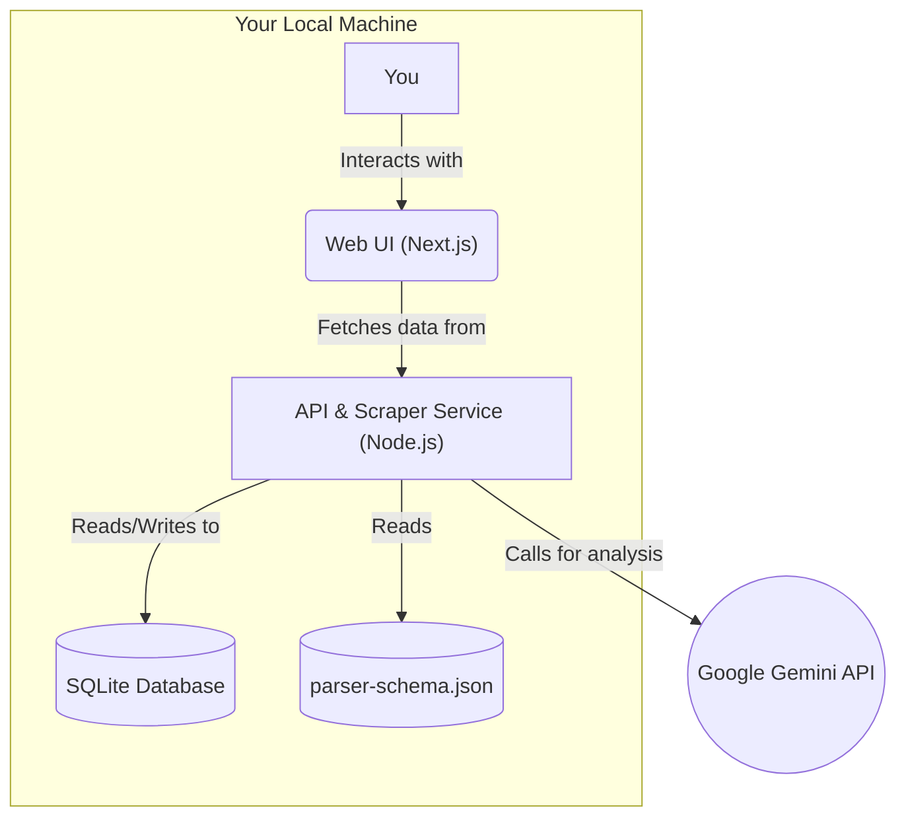

# High Level Architecture

## Technical Summary
This project will be a full-stack application operating under a local-first execution model. The system consists of two primary components within a monorepo: a backend service built with Node.js responsible for scraping and AI analysis, and a frontend web application built with Next.js for the user interface. Key architectural patterns include a schema-driven parser for resilience, an AI abstraction layer for future flexibility, and a repository pattern for clean data access. This design directly supports the MVP goal of creating a fast, zero-cost, and powerful personal analysis tool.

## Platform and Infrastructure Choice
* **Platform:** Local-First Execution Model. The entire application is designed to run on your local desktop/laptop machine.
* **Key Services:**
    * **Local:** Node.js Runtime, SQLite Database Engine, Local File System.
    * **External:** Google Gemini API.
* **Deployment Host and Regions:** N/A - Local execution.

## Repository Structure
* **Structure:** Monorepo
* **Monorepo Tool:** Turborepo
* **Package Organization:** The monorepo will contain `apps` (for the `web` UI and `api` backend) and `packages` (for shared code like `types` and `db` access).

## High Level Architecture Diagram

## Architectural Patterns

  * **Local-First Architecture:** All core components run locally. *Rationale:* This provides the fastest development path and achieves the zero-cost requirement for the MVP.
  * **Monorepo:** A single repository for all code. *Rationale:* Simplifies sharing types and logic between the frontend and backend.
  * **Schema-Driven Parser:** The scraper's parsing logic is externalized to a JSON file. *Rationale:* This makes the scraper resilient to website changes.
  * **AI Provider Abstraction Layer:** AI calls are routed through an internal service. *Rationale:* Decouples the application from a specific AI provider, making it easy to add others in the future.
  * **Declarative Prompt Architecture:** AI prompts are defined in versioned markdown files, not hardcoded in TypeScript. *Rationale:* Enables rapid iteration on prompt quality without code changes, similar to how configuration-driven parsers work. Prompts become versionable data artifacts that can be improved independently of business logic.
  * **Repository Pattern:** Database interactions will be handled by a dedicated "repository" layer. *Rationale:* This abstracts the data logic, making the application easier to test.
  * **Service Contract Architecture:** Cross-package service dependencies use interface contracts and dependency injection. *Rationale:* Enables proper testing with mocks and maintains clean architectural boundaries.
  * **Integration Testing Infrastructure:** Comprehensive testing framework with service abstractions and mock implementations. *Rationale:* Ensures reliable cross-package integration testing in the monorepo environment.

